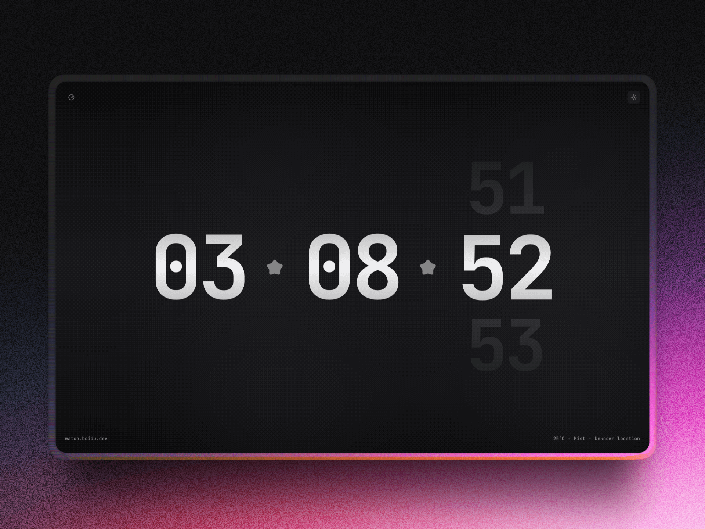

# watch.boidu.dev



<p align="center">A beautifully crafted, opinionated standby clock.</p>

## Demo

Visit [watch.boidu.dev](https://watch.boidu.dev) to see it in action.

## Features

- Clean, minimal clock display
- Theme switching (light/dark mode)
- Weather & Location integration
- Multiple customizable backdrop effects
- Font selection with easy scaffolding
- Responsive design with Tailwind CSS
- Smooth animations with Motion

## Development

### Prerequisites

- Node.js
- pnpm

### Getting Started

1. Install dependencies:
   ```bash
   pnpm install
   ```

2. Start the development server:
   ```bash
   pnpm dev
   ```

3. Open [http://localhost:5173](http://localhost:5173) in your browser

### Scripts

- `pnpm dev` - Start development server
- `pnpm build` - Build for production
- `pnpm preview` - Preview production build
- `pnpm lint` - Run ESLint

## Configuration

The project features a centralized theme system that allows easy customization:

- **Backdrop effects** - Multiple animated background options
- **Font selection** - Choose from various carefully selected typefaces

## Tech Stack

- **React** - UI library
- **Vite** - Build tool
- [**Motion**](https://motion.dev) - Animations
- [**Number Flow**](https://number-flow.barvian.me/) - Animated numbers
- [**Tailwind CSS**](https://tailwindcss.com) - Styling
- [**Paper Shaders**](https://github.com/paper-design/shaders) - Shaders
- [**TanStack Query**](https://tanstack.com/query/latest) - Data fetching
- [**pqoqubbw/icons**](https://icons.pqoqubbw.dev/?q=clock) - Animated icons

## Deployment

Build the project for production:

```bash
pnpm build
```

The built files will be in the `dist` directory, ready to deploy to any static hosting service.

## Adding Custom Elements

This project uses a centralized configuration system that makes it easy to add new fonts and backdrop effects.

### Fonts

Add a font by updating `utils/config.ts`:

```typescript
{ name: "Font Name", displayName: "Display Name", twClass: "font-css-class" }
```

> [!TIP]
> Make sure you've added the proper font imports and custom tailwind classes under `index.css`

### Backdrops

1. Create your component in `components/backdrops/`
2. Add to config:

```typescript
// Import at top of config.ts
import YourBackdrop from "@/components/backdrops/your-backdrop";

// Add to BACKDROP_CONFIGS array
{ id: "backdrop-id", name: "Backdrop Name", component: YourBackdrop }
```

## License

[MIT](./LICENSE)
